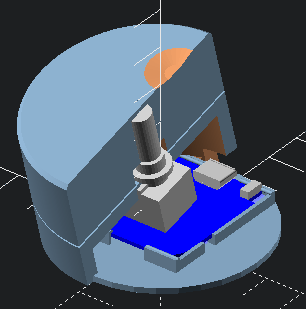

# KnobLight

Knoblight is a little IoT light knob acting as a dimmer for some homeassistant lights.
Once it's powered, it will connect to a wifi network and discuss with [Home Assistant (https://www.home-assistant.io)](https://www.home-assistant.io/) through [MQTT (https://www.home-assistant.io/integrations/mqtt)](https://www.home-assistant.io/integrations/mqtt/).



## Scad design

You'll need to clone this openscad [library (https://github.com/heiso/openscad-bits)](https://github.com/heiso/openscad-bits) in your openscad libraries folder (probably `~/Documents/OpenSCAD/libraries/` on mac).

## Arduino code

You should copy `src/secrets.tpl.h` as `src/secrets.h` and set your values before trying to flash to your esp8266

## HA automation example

Given we want to control lights in the area_id **room**

```yaml
- id: 'knoblight_dimmer'
  alias: Knoblight - dimmer
  description: 'Set brightness accordingly to knoblight turns'
  trigger:
  - platform: mqtt
    topic: knoblight/brightness/set
  condition: []
  action:
  - service: light.turn_on
    data_template:
      transition: 1
      brightness: '{{ trigger.payload_json }}'
    target:
      area_id: room
  mode: queued
  max: 5

- id: 'knoblight_btn'
  alias: Knoblight - btn
  description: 'Toggle lights on knoblight btn pressed'
  trigger:
  - platform: mqtt
    topic: knoblight/btn
  condition: []
  action:
  - service: light.toggle
    data: {}
    target:
      area_id: room
  mode: single

- id: 'knoblight_sync'
  alias: Knoblight - sync
  description: 'Periodically send the light brightness to the knob so it can stay up to date'
  trigger:
  - platform: time_pattern
    seconds: /10
  condition: []
  action:
  - service: mqtt.publish
    data:
      topic: knoblight/brightness
      payload_template: '{{ state_attr(''light.room'', ''brightness'') }}'
  mode: single
```

## BOM (Bill Of Materials)

1 KY_040_encoder  
1 Wemos D1 mini (esp8266)
